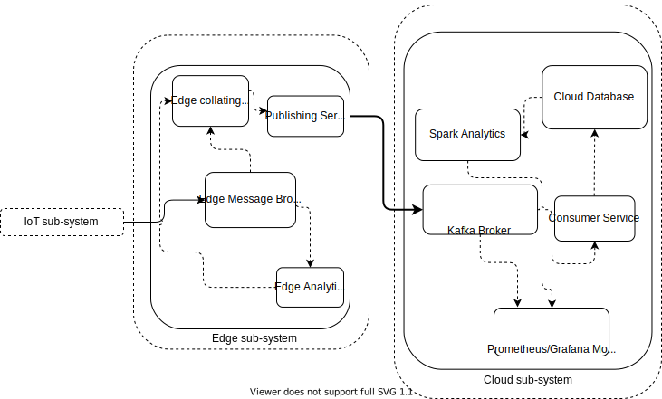

## IoT-based Equipment Monitoring Scenario in  Edge-Cloud Systems
This collates the configurations and scripts of external artefacts providers for establishing an IoT-based equipment monitoring scenario in an edge-cloud infrastructure.

In this scenario we use GPON monitoring data to establish the scenario.


#### Requirements
To illustrate the scenario, almost all the components (external artefacts) that we are using are dockerized. To run this simulation, we will need,
* Docker and docker-compose
* python3 (optional for some components)
* Kubernetes (They were tested on openshift k8s platform)

>Note some services might be based on VMs. We have not tested VM configurations but you can try.

#### Structure
```
folders
│
└───cloudBrokerProvider
└───cloudDatabaseProvider
└───cloudDockerizedMonitoringProvider
└───cloudIngestorProvider
└───cloudKubernetesAnalyticsProvider
└───cloudKubernetesMonitoringProvider
└───edgeBrokerProvider
└───IoTSensorPublishProvider
└───IoTSensorBatchingBridge
```

All these folders have the readme on the relevant configurations for these external providers and how to run them.

#### System Overview
Using the scripts/configurations/code, the GPON monitoring scenario will be provisioned as following:



---

## Note
* It is up to the user to make sure that the configuration file is well defined (e.g. topic names match between ingestionClients and sensors)
* Look at further notes in different directories to see if the scenario can be extended or adapted with different types of IoT, edge and cloud units/providers.
